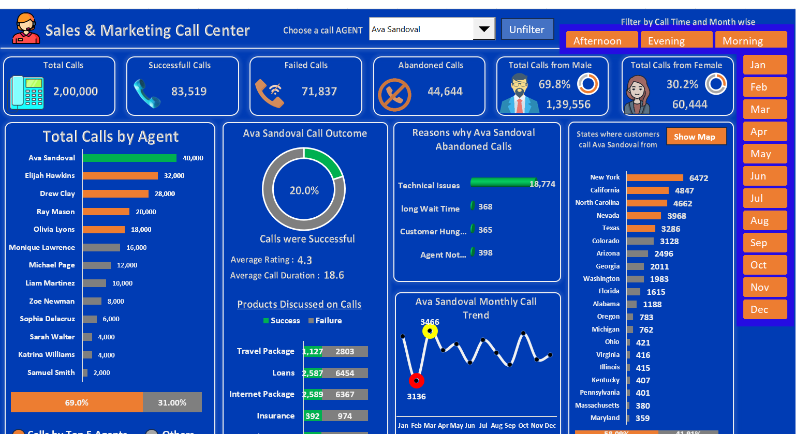

# 📊 Sales & Marketing Call Centre Dashboard (Excel)

An **interactive Excel dashboard** to monitor **sales, marketing, and call centre performance** — all in one place.  
Easily track **call volumes, lead conversions, campaign impact, and agent productivity** with dynamic charts, slicers, and pivot tables.

---

## 🚀 Features
✅ Sales & marketing KPIs  
✅ Call volume & handling time trends  
✅ Lead conversion tracking  
✅ Campaign performance insights  
✅ Interactive slicers & pivot tables  

---

## 📊 Preview
  

---

## 📂 Files in This Repository
- **Dashboard.xlsm** → Main interactive dashboard  

---

## 🛠 Tools Used
- **Microsoft Excel** (Pivot Tables, Slicers, Charts)  
- **Formulas**: VLOOKUP, Dynamic Method  
- **Data Cleaning & Visualization** in Excel  

---

## 📌 Quick Start
1. Download `Dashboard.xlsm`  
2. Enable macros if prompted  
3. Use slicers to filter  
4. Update data → visuals refresh automatically  

---

## 📢 Author
Created by **[Girish Kumar V](https://github.com/GirishKumarV25)** – Passionate about **data analytics, visualizations**.

---
